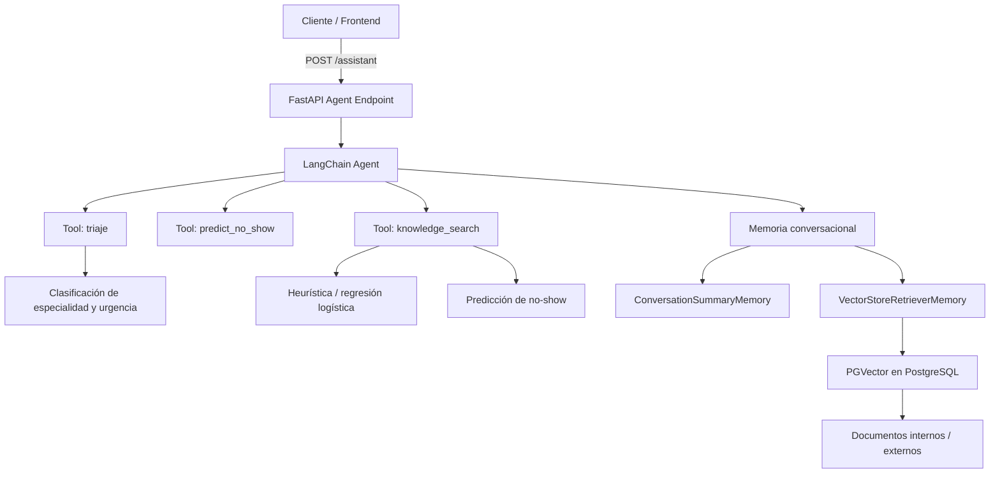

# MediFlow — agendamiento con PostgreSQL, FastAPI y React

## Requisitos

- Python 3.11+ (probado también en 3.14 con dependencias flexibles de `requirements.txt`)
- Node.js 20+
- PostgreSQL 16 con extensión `pgvector` (recomendado vía Docker: `docker compose up -d` en la raíz del proyecto)

El modelo de riesgo de inasistencia usa **regresión logística entrenada en Python puro** cuando hay suficiente historial; si no, aplica una heurística con tasas agregadas por paciente y especialidad.

## Configuración

1. Base de datos: copia `backend/.env.example` a `backend/.env` y ajusta `DATABASE_URL`, `JWT_SECRET`, `ADMIN_EMAILS` (correos con rol admin), `ROQ_API_KEY` (opcional, triaje con IA) y `GOOGLE_CLIENT_ID` (opcional, login Google en backend).

2. Frontend: copia `frontend/.env.example` a `frontend/.env` y define `VITE_API_URL` (por defecto `http://127.0.0.1:8000`). Opcional: `VITE_GOOGLE_CLIENT_ID` alineado con el de Google Cloud.

## Arranque

En una terminal, desde `backend/`:

```bash
python -m venv .venv
.venv\Scripts\activate
pip install -r requirements.txt
python -m uvicorn app.main:app --reload --host 0.0.0.0 --port 8000 --app-dir .
```

En otra terminal, desde `frontend/`:

```bash
npm install
npm run dev
```

Abre `http://localhost:3000`. Registra un usuario; si el correo está en `ADMIN_EMAILS`, tendrá vista de gestión.

## Migraciones (Alembic)

El arranque del API ejecuta `create_all` para crear tablas si no existen. Para entornos con migraciones explícitas:

```bash
cd backend
alembic upgrade head
```

## RAG y asistente AI

Este proyecto incluye un asistente RAG que usa fuentes internas y externas de datos para enriquecer respuestas de consulta. El endpoint disponible es `POST /assistant` y ahora funciona con un agente LangChain basado en herramientas, memoria y recuperación semántica.

- `triage`: clasifica síntomas y devuelve specialty, urgencia y reasoning.
- `predict_no_show`: calcula riesgo de no-show a partir de specialty, urgencia y fecha/hora.
- `knowledge_search`: consulta la memoria de conocimiento semántica construida sobre documentos internos/externos.

### Cómo usar el agente

Llama al endpoint `POST /assistant` con JSON:

```json
{
  "question": "Tengo dolor de pecho y dificultad para respirar",
  "session_id": "optional-session-id"
}
```

Si proporcionas `session_id`, la conversación se mantiene y se almacena en memoria.

- `OPENAI_API_KEY` es necesario para el agente LangChain y la memoria semántica pgvector.
- `ROQ_API_KEY` sigue siendo usada como respaldo para el flujo RAG local.
- La respuesta incluye `used_tools`, el conjunto de herramientas que el agente invocó para resolver la consulta.

## Arquitectura del agente



El agente toma decisiones adaptativas en tiempo real, eligiendo qué herramienta invocar según la intención del mensaje y apoyándose en memoria multimodal.

## Documentación adicional

- `docs/Informe.md`: informe técnico con caso organizacional, arquitectura, prompts, RAG y justificación técnica.
- `docs/Pauta.md`: checklist de entrega que resume el cumplimiento de la pauta y la validación ejecutada.

## Informe técnico y pauta de evaluación

El diseño, arquitectura y justificación se describen en `docs/Informe.md`. Ese documento incluye un mapeo explícito a los criterios de evaluación de la pauta, con arquitectura, decisiones y cobertura de IA/RAG.

## Pruebas backend

```bash
cd backend
pytest
```
