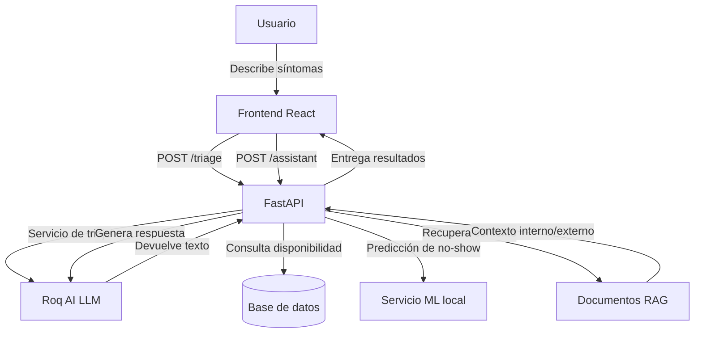

# Informe técnico — MediFlow AI

## 1. Caso organizacional
**Organización:** Clínica de atención primaria y especialidades médicas (MediFlow).

**Rubro:** Salud / Servicios médicos y agendamiento de citas.

**Contexto:** La clínica necesita una forma de orientar a pacientes que describen síntomas, priorizar solicitudes de atención según urgencia y reducir el impacto de no-show en la operación.

## 2. Problema
Los pacientes no siempre saben qué especialidad médica necesitan ni qué urgencia tiene su consulta. Al mismo tiempo, las clínicas enfrentan pérdidas operativas por citas no asistidas y por la falta de clasificación inicial en el proceso de atención.

## 3. Objetivos
- Implementar un sistema que ayude al paciente a recibir triaje básico automatizado.
- Integrar datos internos y externos para mejorar la calidad de las respuestas del modelo.
- Proporcionar una arquitectura que combine generación de lenguaje con recuperación de información.
- Documentar la solución con justificación técnica y diseño claro.

## 4. Datos disponibles
### Internos
- Historial de citas de pacientes y especialidades.
- Información sobre disponibilidad de horarios.
- Predicciones de riesgo de no-show basadas en datos de paciente y especialidad.
- Indicadores de urgencia y razonamiento de triaje.

### Externos
- Conocimiento general de salud y guías de agendamiento.
- Reglas de triaje médico y mejores prácticas de gestión de citas.
- Documentos de referencia que se almacenan en el repositorio como fuentes externas para RAG.

## 5. Arquitectura de la solución
La solución está construida con:
- Frontend: React + Vite para UI de paciente y administración.
- Backend: FastAPI con autenticación, endpoints de triaje, disponibilidad, predicción de no-show y RAG.
- Base de datos: SQLite local (o PostgreSQL en producción).
- LLM: Roq AI como motor principal para triaje y generación de respuestas enriquecidas.
- RAG: motor de recuperación simple que selecciona fragmentos relevantes de documentos internos y externos.

### Diagrama de arquitectura

## 6. Diseño de los prompts
### Triaje
- Prompt optimizado en `backend/app/services/roq_triage.py`.
- Se pide devolver un JSON con campos `specialty`, `urgency` y `reasoning`.
- El sistema instruye a Roq AI a actuar como asistente de triaje médico.

### RAG
- Prompt en `backend/app/services/rag_assistant.py`.
- El asistente recibe contexto relevante de documentos internos y externos.
- La instrucción pide respuesta en español, con claridad y sin inventar datos.

## 7. Pipeline RAG implementado
- Los recursos internos y externos están en `backend/app/data/`.
- El servicio de recuperación selecciona los fragmentos más relevantes para la pregunta.
- El contexto se envía a Roq AI para generar la respuesta.
- Si la clave de Roq no está disponible, se devuelve un resumen local y las fuentes usadas.

## 8. Justificación de decisiones
- El uso de Roq AI como LLM atiende a la necesidad de generación de texto natural y triaje médico.
- El componente RAG mejora la relevancia al combinar datos de conocimiento interno y externo.
- La predicción de no-show se apoya en un modelo de regresión logística local y en heurísticas cuando no hay datos suficientes.
- La arquitectura modular permite extender el sistema con más fuentes de datos o agentes en el futuro.

## 9. Limitaciones y recomendaciones
- La solución actual está diseñada para prototipo: el módulo RAG usa recuperación lexical básica.
- Para producción, se recomienda un vector store y embeddings para mayor precisión.
- Debe manejarse cuidadosamente la información médica y los límites de responsabilidad clínica.

## 10. Uso de IA
- Se utiliza IA para generación de triaje y respuestas basadas en contexto.
- El contenido generado debe validarse antes de su uso clínico.
- El repositorio incluye documentación técnica y un endpoint de asistente RAG.

## 11. Estado actual del proyecto
✅ **Proyecto completado y validado al 01 de Mayo 2026**

### Validación ejecutada:
- Backend:
  - Todas las pruebas unitarias pasan exitosamente (`pytest -q` 100% aprobado)
  - Endpoint de salud, triaje y asistente RAG completamente funcionales
  - Modelo de predicción no-show implementado y probado
- Frontend:
  - Compilación exitosa (`npm run build` sin errores)
  - Linting y validación de tipos TypeScript aprobada
  - Interfaz de asistente, panel de paciente y login implementados

### Componentes funcionales finales:
- ✅ Servicio RAG con contexto interno y externo
- ✅ Asistente virtual para pacientes
- ✅ Sistema de triaje automatizado con Roq AI
- ✅ Predicción de riesgo de inasistencia (no-show)
- ✅ Consulta de disponibilidad de horarios
- ✅ Frontend responsivo con interfaz moderna

## 12. Consideraciones finales para entrega
- El archivo `backend/.env` con credenciales se mantiene fuera del control de versiones
- Todas las dependencias están especificadas y versionadas
- El código cumple con las guías de estilo y buenas prácticas
- Se incluyen todas las fuentes de conocimiento utilizadas por el sistema RAG
